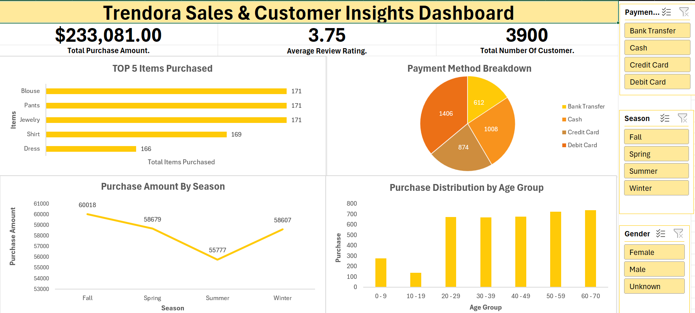

\# Excel Module Project – Trendora Shopping Data Dashboard

\## Overview

This project is an Excel-based analysis and dashboard built on the Trendora shopping dataset, completed as part of the Torilo Academy Data Analysis Program. It demonstrates core Excel skills — from data cleaning to formulas to interactive dashboard design.

\## Objective

The goal was to analyze Trendora's shopping data to uncover patterns in sales, customer behavior, and product performance, then present these findings through a clear, interactive dashboard.

\## Tools Used

\- \*\*Microsoft Excel\*\* – data cleaning, formulas, pivot tables, and dashboard design

\## Dataset

The dataset used is `Raw\_data\_set.xlsx`, located in the `Data/` folder. It contains transactional shopping data used as the basis for the analysis.

\## Project Structure

├── trendora\_shopping\_data\_Module Project.xlsx   # Main Excel workbook with analysis and dashboard

├── Analysis\_Report.pdf                          # Full write-up of findings and methodology

├── Data/

│   └── Raw\_data\_set.xlsx                        # Source dataset used for the analysis

├── images/

│   └── trendora\_dashboard\_Olaseni\_kamorudeen\_Lawal.png   # Dashboard screenshot

└── README.md                                    # Project overview (this file)

\## How to Use This Project

1\. Open `trendora\_shopping\_data\_Module Project.xlsx` in Microsoft Excel.

2\. Explore the dashboard sheet(s) to view sales trends, customer insights, and product performance.

3\. Refer to `Analysis\_Report.pdf` for the full breakdown of methodology and key findings.

\## Key Insights

The dashboard highlights sales trends, top-performing products, and customer purchasing patterns within the Trendora dataset. Full details are available in the Analysis Report.

\## Author

Olaseni Lawal

